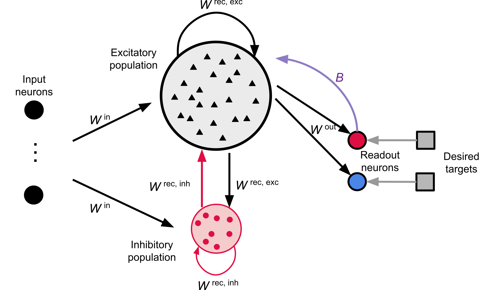

# Motor Controller Spiking Neural Network (SNN) Model with e-prop

This repository contains code, data, and neuron models for simulating and analyzing motor control experiments using spiking neural networks and the e-prop (eligibility propagation) learning algorithm. The network models motor cortex (M1) activity for a movement task, using e-prop learning as implemented in NEST.

<p align="center">
   
</p>

**Figure 1. Schematic of the spiking neural network (SNN) architecture for motor control.**  
On the left, labeled "input neurons," time-varying joint angles are received as external signals. These signals are projected into a central recurrent network (reservoir), which models the motor cortex (M1). Within the reservoir, black triangles represent individual excitatory spiking neurons, while the red circle at the bottom denotes the inhibitory neuron population—crucial for dynamically balancing network activity via recurrent inhibition.  
The recurrent network outputs to two readout neurons via e-prop synapses: a red circle ("pos" channel) and a blue circle ("neg" channel), each corresponding to a motor output direction. Gray arrows from these readout neurons point to target signals, illustrating supervised learning via error comparison. The purple arrow labeled "B" represents the feedback path by which the readout neurons send the e-prop learning signal (global error signal) back to the recurrent network, enabling biologically plausible online synaptic adaptation.  
Colors and shapes explicitly encode network roles: labeled input neurons (left), excitatory reservoir neurons (black triangles), inhibitory population (red circle), and output channels (red and blue circles).

## Repository Structure

* `motor_controller_eprop_tutorial.ipynb` — Jupyter notebook tutorial demonstrating how to use the main modules and run motor control experiments with e-prop. Recommended for new users to get started quickly.
* `eprop-motor-control/` — Main module for running motor control experiments, training spiking networks, analyzing results, and visualizing outputs. See its README for detailed usage and options.
* `dataset_motor_training/` — Contains trajectory data, spike datasets, and utilities for dataset handling. Includes a README describing the dataset format.
* `nestml-neurons/` — NESTML neuron model files and generated NEST target code for custom neuron modules.
* `testing-nestml-neurons/` — Scripts and Jupyter notebooks for compiling, installing, and testing custom NESTML neuron models.
* `report/` — Documentation, figures, or analysis reports (if present).

## Getting Started

1. **Environment Setup:**
   - Use the provided `eprop-motor-control/environment.yml` to create a conda/mamba environment with all required dependencies (NEST, NESTML, Python packages, build tools).
   - Example:
     ```bash
     mamba env create -f eprop-motor-control/environment.yml
     mamba activate motor-controller
     ```

2. **Run Experiments:**
   - See `eprop-motor-control/README.md` for instructions on running experiments, parameter sweeps, and analyzing results.

3. **Tutorial Notebook:**
   - Open `motor_controller_eprop_tutorial.ipynb` for a step-by-step guide to running motor control experiments and using the main features of the repository. This notebook is ideal for new users and provides practical examples.

4. **Network Overview Figure:**
   - Refer to `overview_network.png` for a visual summary of the spiking neural network architecture used in the motor control experiments. This figure helps clarify the network's components and connectivity.

3. **Dataset:**
   - See `dataset_motor_training/README.md` for details on the dataset format and usage.

## Submodule READMEs

Each main folder contains its own README with specific instructions and details. Refer to those for module-specific workflows.

## License
<Specify your license here>
